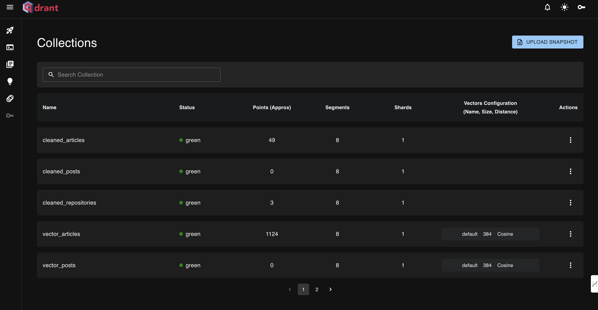

<table style="border-collapse: collapse; border: none;">
  <tr style="border: none;">
    <td width="20%" style="border: none;">
      <a href="https://decodingml.substack.com/" aria-label="Decoding ML">
        
      </a>
    </td>
    <td width="80%" style="border: none;">
      <div>
        <h2>📬 Stay Updated</h2>
        <p><b><a href="https://decodingml.substack.com/">Join Decoding ML</a></b> for proven content on designing, coding, and deploying production-grade AI systems with software engineering and MLOps best practices to help you ship AI applications. Every week, straight to your inbox.</p>
      </div>
    </td>
  </tr>
</table>

<p align="center">
  <a href="https://decodingml.substack.com/">
    
  </a>
</p>

------

# Install 

## Local dependencies

Before starting to install the LLM Twin project, make sure you have installed the following dependencies on your local system:

| Tool | Version | Purpose | Installation Link |
|------|---------|---------|------------------|
| Python | 3.11 | Runtime environment | [Download](https://www.python.org/downloads/) |
| Poetry | ≥1.8.4 | Package management | [Install Guide](https://python-poetry.org/docs/) |
| GNU Make | ≥3.81 | Build automation | [Install Guide](https://www.gnu.org/software/make/) |
| Docker | ≥27.0.3 | Containerization | [Install Guide](https://www.docker.com/) |
| AWS CLI | ≥2.18.5 | Cloud management | [Install Guide](https://docs.aws.amazon.com/cli/latest/userguide/getting-started-install.html) |

## Cloud services

The code also uses and depends on the following cloud services. For now, you don't have to do anything. We will guide you in the installation and deployment sections on how to use them:

| Service | Purpose | Cost | Mandatory Credentials |
|---------|---------|---------|---------|
| [HuggingFace](https://huggingface.com/) | Model registry | Free | `HUGGINGFACE_ACCESS_TOKEN` |
| [Comet ML](https://www.comet.com/site/) | Experiment tracker | Free tier available | `COMET_API_KEY` <br> `COMET_WORKSPACE` | 
| [Opik](https://www.comet.com/site/products/opik/) | Prompt monitoring & LLM Evaluation | Free tier available | `COMET_API_KEY` <br> `COMET_WORKSPACE` |
| [OpenAI API](https://openai.com/index/openai-api/) | LLM API for recommender system | Pay-per-use | `OPENAI_API_KEY` | [Quick Start Guide](https://platform.openai.com/docs/quickstart) |
| [MongoDB](https://www.mongodb.com/) | NoSQL database | Free tier available | - |
| [Qdrant](https://qdrant.tech/) | Vector database | Free tier available | - |
| [AWS](https://aws.amazon.com/) | Compute and storage | Pay-per-use | `AWS_ARN_ROLE` <br> `AWS_REGION` <br> `AWS_ACCESS_KEY` <br> `AWS_SECRET_KEY` |

> [!IMPORTANT]
> Also, you must manually ask for access on Hugging Face for the gated LLM `meta-llama/Llama-3.1-8B` we use throughout the course. It's free. [Do it here](https://huggingface.co/meta-llama/Llama-3.1-8B).


## Supported commands

We will use `GNU Make` to install and run our application.

To see all our supported commands, run the following:
```shell
make help
```

## Configure

All the sensitive credentials are placed in a `.env` file that will always sit at the root of your directory, at the same level with the `.env.example` file.

Go to the root of the repository and copy our `.env.example` file as follows:
```shell
cp .env.example .env
```
Now fill it with your credentials, following the suggestions from the next section.

### Getting credentials for cloud services

Now, let's understand how to fill in all the essential variables within the `.env` file to get you started. The following are the mandatory settings we must complete when working locally:

#### OpenAI

To authenticate to OpenAI's API, you must fill out the `OPENAI_API_KEY` env var with an authentication token.

```env
OPENAI_API_KEY=your_api_key_here
```

→ Check out this [tutorial](https://platform.openai.com/docs/quickstart) to learn how to provide one from OpenAI.

#### Hugging Face

To authenticate to Hugging Face, you must fill out the `HUGGINGFACE_ACCESS_TOKEN` env var with an authentication token.

```env
HUGGINGFACE_ACCESS_TOKEN=your_token_here
```

→ Check out this [tutorial](https://huggingface.co/docs/hub/en/security-tokens) to learn how to provide one from Hugging Face.

#### Comet ML & Opik

To authenticate to Comet ML (required only during training) and Opik (uses the same Comet credentials), you must fill out the `COMET_API_KEY` and `COMET_WORKSPACE` env vars with your authentication token and workspace name.

```env
COMET_API_KEY=your_api_key_here
COMET_WORKSPACE=your_workspace_name_here
```

→ Check out this [tutorial](https://www.comet.com/docs/v2/api-and-sdk/rest-api/overview/) to learn how to get the Comet ML variables from above. You can also access Opik's dashboard using 🔗[this link](https://www.comet.com/opik).

#### AWS

Required only for fine-tuning and inference, which we will show how to set up later in the document.

#### Qdrant

Optional, only if you want to use Qdrant cloud. Otherwise, you can complete the course using the local version of Qdrant.

## Install local dependencies

You can create a Python virtual environment and install all the necessary dependencies using Poetry, by running:
```shell
make install
```
> [!IMPORTANT] 
> You need Python 3.11 installed! You can either install it globally or install [pyenv](https://github.com/pyenv/pyenv) to manage multiple Python dependencies. The `.python-version` file will signal to `pyenv` what Python version it needs to use in this particular project.

After installing the dependencies into the Poetry virtual environment, you can activate your virtual environment into your current CLI by running:
```bash
poetry shell
```

## Set up the data infrastructure

We support running the entire data infrastructure (crawling, CDC, MongoDB, and Qdrant) through Docker. Thus, with a few commands you can quickly populate the data warehouse and vector DB with relevant data to test out the RAG, training, and inference parts of the course.

### Spin up the infrastructure

You can start all the required Docker containers, by running:
```shell
make local-start
```
It will take a while to run until all the Docker images are pulled or built.

Behind the scenes it will build and run all the Docker images defined in the [docker-compose.yml](https://github.com/decodingml/llm-twin-course/blob/main/docker-compose.yml) file.

> [!CAUTION]
> For `MongoDB` to work with multiple replicas (as we use it in our Docker setup) on `macOS` or `Linux` systems, you have to add the following lines of code to `/etc/hosts`:
>
> ```
> 127.0.0.1       mongo1
> 127.0.0.1       mongo2 
> 127.0.0.1       mongo3
> ```
>
> From what we know, on `Windows`, it `works out-of-the-box`. For more details, check out this [article](https://medium.com/workleap/the-only-local-mongodb-replica-set-with-docker-compose-guide-youll-ever-need-2f0b74dd8384)

> [!WARNING]
> For `arm` users (e.g., `M macOS devices`), go to your Docker desktop application and enable `Use Rosetta for x86_64/amd64 emulation on Apple Silicon` from the Settings. There is a checkbox you have to check.
> Otherwise, your Docker containers will crash.

### Tear down the infrastructure

Run the following `Make` command to tear down all your docker containers:

```shell
make local-stop
```

# Usage: Run an end-to-end flow

Now that we have configured our credentials, local environment and Docker infrastructure let's look at how to run an end-to-end flow of the LLM Twin course.

> [!IMPORTANT]
> Note that we won't go into the details of the system here. To fully understand it, check out our free lessons, which explains everything step-by-step: [LLM Twin articles series](https://medium.com/decodingml/llm-twin-course/home).

### Step 1: Crawling data

Trigger the crawler to collect data and add it to the MongoDB:

```shell
make local-test-medium
# or make local-test-github
``` 
You should get a response with a `200` status code, as follows:
```
{"statusCode": 200, "body": "Link processed successfully"}
```

After running the command, this will happen:
1. it will crawl a Medium/GitHub link
2. process and add the data to MongoDB
3. the CDC component will be triggered, which will populate the RabbitMQ with the event
4. the RAG feature pipeline will read the event from RabbitMQ, process it for RAG, and add it to the Qdrant vector DB

You can check the logs from the crawler Docker image, by running:
```bash
docker logs llm-twin-data-crawlers
``` 
You should see something similar to:
```text
{"level":"INFO","location":"extract:53","message":"Finished scrapping custom article: https://medium.com/decodingml/an-end-to-end-framework-for-production-ready-llm-systems-by-building-your-llm-twin-2cc6bb01141f","timestamp":"2024-12-25 17:13:33,630+0000","service":"llm-twin-course/crawler"}
```

### Step 2: Feature engineering & Vector DB

The previous step actually called both the crawling and RAG feature engineering pipeline. But now, let's check that everything worked as expected.

Thus, let's check that the feature pipeline works and the vector DB is successfully populated.

To do so, check the logs of the `llm-twin-feature-pipeline` Docker container by running:
```shell
docker logs llm-twin-feature-pipeline
```
You should see something similar to:
```text
2024-12-25 16:53:45 [info     ] Cleaned content chunked successfully. cls=data_logic.dispatchers data_type=repositories num=955
2024-12-25 16:53:45 [info     ] Chunk embedded successfully.   cls=data_logic.dispatchers data_type=repositories embedding_len=384
2024-12-25 16:53:45 [info     ] Chunk embedded successfully.   cls=data_logic.dispatchers data_type=repositories embedding_len=384
```
Also, you can check the logs of the CDC and RabbitMQ Docker containers, by running:
```bash
docker logs llm-twin-data-cdc # CDC service
docker logs llm-twin-mq # RabbitMQ
```

You should see logs reflecting the cleaning, chunking, and embedding operations (without any errors, of course).

To check that the Qdrant `vector DB` is populated successfully, go to its dashboard by typing in your browser: **[localhost:6333/dashboard](localhost:6333/dashboard)**. There, you should see the repositories or article collections created and populated, similar to the image below:



> [!NOTE]
> If using the cloud version of Qdrant, go to your Qdrant account and cluster to see the same thing as in the local dashboard.

### Step 3: Populating MongoDB and Qdrant with more data

To populate MongoDB and VectorDB with ~50 links, run the following command (but first make sure that everything runs smooth):
```bash
make local-ingest-data
```
**Note:** To crawl different links, you can change the `data/links.txt` file. 

### Step 4: Testing the RAG retrieval step

Now that our Qdrant vector DB is populated with our data let's test out the RAG retrieval module to see that everything works fine by retrieving some items using a dummy query:
```shell
make local-test-retriever
```

> [!IMPORTANT]
> Before running this command, check [Qdrant's dashboard](localhost:6333/dashboard) to ensure your vector DB is populated with data. Otherwise, the retriever will not have any data to work with.

### Step 5: Generating the instruct dataset

The last step before fine-tuning is to generate an instruct dataset and track it as an artifact with Comet ML. To do so, run:
```shell
make local-generate-instruct-dataset
```

Now go to [Comet ML](https://www.comet.com/signup/?utm_source=decoding_ml&utm_medium=partner&utm_content=github), then to your workspace, and open the `Artifacts` tab. There, you should find three artifacts as follows:
> - `articles-instruct-dataset` 
> - `posts-instruct-dataset`
> - `repositories-instruct-dataset`

To download the instruct dataset from Comet, run:
```bash
make download-instruct-dataset
```

> [!NOTE]
> We also publicly provide our own artifacts that you can use to fine-tune your LLMs in case you got stuck or don't want to generate them yourself:
> - [articles-instruct-dataset](https://www.comet.com/decodingml/artifacts/articles-instruct-dataset)
> - [posts-instruct-dataset](https://www.comet.com/decodingml/artifacts/posts-instruct-dataset)
> - [repositories-instruct-dataset](https://www.comet.com/decodingml/artifacts/repositories-instruct-dataset)

### Step 6: Setting up AWS SageMaker

For your AWS set-up to work correctly, you need the AWS CLI installed on your local machine and properly configured with an admin user (or a user with enough permissions to create new SageMaker, ECR and S3 resources; using an admin user will make everything more straightforward).

With the same configuration used to set up your AWS CLI, also fill in the following environment variables from your `.env` file:
```bash
AWS_REGION=eu-central-1
AWS_ACCESS_KEY=str
AWS_SECRET_KEY=str
```
AWS credentials are typically stored in `~/.aws/credentials`. You can view this file directly using `cat` or similar commands:
```shell
cat ~/.aws/credentials
```

The next step is to create an IAM execution role used by AWS SageMaker to access other AWS resources. This is standard practice when working with SageMaker.

To automatically create it, run:
```bash
make create-sagemaker-execution-role
```

The script will generate a file found at `src/sagemaker_execution_role.json`. Open it, copy the value under the `RoleArn` key from the JSON file, and fill in the following env var from your `.env` file:
```bash
AWS_ARN_ROLE=str
```

To conclude, by the end of this section you should have filled correctly the following environment variables in your `.env` file:
```bash
AWS_ARN_ROLE=str
AWS_REGION=eu-central-1
AWS_ACCESS_KEY=str
AWS_SECRET_KEY=str
```

Now, we can move on to the fine-tunine and inference pipelines, which use AWS SagaMaker.

> [!IMPORTANT]
> Note that we use `ml.g5.2xlarge` EC2 instances to run AWS SageMaker (which are already set in our settings), which cost `~$2 / hour` (depending on your region). Our tests will take only ~2-3 hours at maximum. Thus, this won't get expensive. Just run our clean-up resources scripts after you finish testing our app: `make delete-inference-pipeline-deployment`

### Step 7: Starting the fine-tuning pipeline

First, go to our base model, which we will use for fine-tuning on Hugging Face -> [meta-llama/Llama-3.1-8B](https://huggingface.co/meta-llama/Llama-3.1-8B) and get access to use it. Everything is free.

Next, after setting up everything necessary for AWS SageMaker and Llama-3.1-8B, kicking off the training in dummy mode is as easy as running the following (dummy mode will reduce the dataset size and epochs to quickly see that everything works fine, reducing the running time <30 minutes):
```bash
make start-training-pipeline-dummy-mode
```

To kick off the full training, run (which will take ~2-3 hours, using our dataset and preconfigured settings):
```bash
make start-training-pipeline
```

Go to your [Hugging Face account](https://huggingface.co/), and under the **Models** section, you will see your `{your_name}/LLMTwin-Llama-3.1-8B` model. To run the evaluation and inference using your fine-tuned LLM, add your Hugging Face model ID to your `.env` file, such as `MODEL_ID=pauliusztin/LLMTwin-Llama-3.1-8B`.

> [!NOTE]
> You can check out the deployment progress in the AWS console in the SageMaker dashboard.

> [!WARNING]
> If you get any `Service Quotas` errors, you must increase your AWS quotas for `ml.g5.2xlarge` instances (which is free). More exactly, you have to go to your AWS account -> Service Quatas -> AWS services -> search `SageMaker` -> search `ml.g5.2xlarge`, then increase the quotas to 1 for `ml.g5.2xlarge for training job usage` (training jobs) and `ml.g5.2xlarge for endpoint usage` (inference jobs). More details on changing service quotas are in [this article](https://docs.aws.amazon.com/servicequotas/latest/userguide/request-quota-increase.html).


### Step 8: Runing the evaluation pipelines

After you have finetuned your LLM, you can start the LLM evaluation pipeline by running:
```shell
make evaluate-llm
```

To start the RAG evaluation pipeline, run:
```shell
make evaluate-rag
```

Next, check the evaluation datasets and experiment results in [Opik's Dashboard](https://www.comet.com/opik).


### Step 9: Testing the inference pipeline

After you have finetuned and evaluated your model, the first step is to deploy the LLM to AWS SageMaker as a REST API service:
```shell
make deploy-inference-pipeline 
```

> [!NOTE]
> You can check out the deployment progress in the AWS console in the SageMaker dashboard.

After the deployment is finished (it will take a few minutes), you can call it with a test prompt by running:
```shell
make call-inference-pipeline
```

After testing the inference pipeline from the CLI, you can start playing around with the LLM Twin from our GUI, by running:
```shell
make local-start-ui
```

Now you can access the GUI at **[http://localhost:7860](http://localhost:7860)** and start asking the LLM Twin to generate some content for you, such as: **"Draft a post about RAG systems."** as in the example below:


After playing around with the model, you will start collecting and monitoring your prompts which you can visualize again in [Opik's Dashboard](https://www.comet.com/opik).

Also, you can kick off the monitoring LLM evaluation pipeline by running:
```bash
make evaluate-llm-monitoring
```

Ultimately, after testing the inference pipeline, you can delete the AWS SageMaker deployment, by running:
```shell
make delete-inference-pipeline-deployment
```

> [!WARNING]
> Clear your AWS resources to avoid any unexpected costs. Running `make delete-inference-pipeline-deployment` should clear everything, but we recommend double-checking your AWS SageMaker dashboard manually to ensure everything is shut down in case of edge cases.
