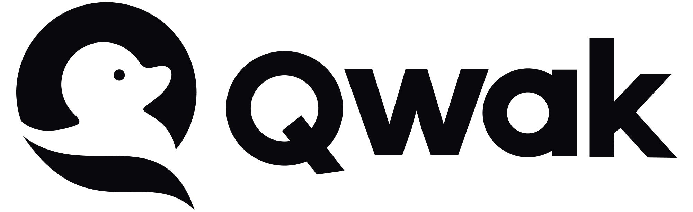

    <h2>LLM Twin Course: Building Your Production-Ready AI Replica</h2>
    <h1>Learn to architect and implement a production-ready LLM & RAG system by building your LLM Twin</h1>
    <h3>From data gathering to productionizing LLMs using LLMOps good practices.</h3>
    <i>by <a href="https://github.com/iusztinpaul">Paul Iusztin</a>, <a href="https://github.com/alexandruvesa">Alexandru Vesa</a> and <a href="https://github.com/Joywalker">Alexandru Razvant</a></i>

 

  

## Why is this course different?

*By finishing the **"LLM Twin: Building Your Production-Ready AI Replica"** free course, you will learn how to design, train, and deploy a production-ready LLM twin of yourself powered by LLMs, vector DBs, and LLMOps good practices.*

> Why should you care? 🫵
> 
> → **No more isolated scripts or Notebooks!** Learn production ML by building and deploying an end-to-end production-grade LLM system.

## What will you learn to build by the end of this course?

You will **learn** how to **architect** and **build a real-world LLM system** from **start** to **finish** - from **data collection** to **deployment**.

You will also **learn** to **leverage MLOps best practices**, such as experiment trackers, model registries, prompt monitoring, and versioning.

**The end goal?** Build and deploy your own LLM twin.

**What is an LLM Twin?** It is an AI character that learns to write like somebody by incorporating its style and personality into an LLM.

## Table of contents

- [1. The architecture of the LLM twin is split into 4 Python microservices:](#the-architecture-of-the-llm-twin-is-split-into-4-python-microservices)
    - [1.1. The data collection pipeline](#the-data-collection-pipeline)
    - [1.2. The feature pipeline](#the-feature-pipeline)
    - [1.3. The training pipeline](#the-training-pipeline)
    - [1.4. The inference pipeline](#the-inference-pipeline)
- [2. Who is this for?](#who-is-this-for)
- [3. How will you learn?](#how-will-you-learn)
- [4. Costs?](#costs)
- [5. Questions and troubleshooting](#questions-and-troubleshooting)
- [6. Lessons](#lessons)
    - [6.1. System design](#system-design)
    - [6.2. Data engineering: Gather & store the data for your LLM twin](#data-engineering-gather--store-the-data-for-your-llm-twin)
    - [6.3. Feature pipeline: prepare data for LLM fine-tuning & RAG](#feature-pipeline-prepare-data-for-llm-fine-tuning--rag)
    - [6.4. Training pipeline: fine-tune your LLM twin](#training-pipeline-fine-tune-your-llm-twin)
    - [6.5. Inference pipeline: serve your LLM twin](#inference-pipeline-serve-your-llm-twin)
    - [6.6. Bonus: refactor and optimize the RAG system](#bonus-refactor-and-optimize-the-rag-system)
- [7. Install & Usage](#install--usage)
- [8. Meet your teachers!](#meet-your-teachers)
- [9. License](#license)
- [10. 🏆 Contribution](#contribution)

## The architecture of the LLM twin is split into 4 Python microservices:

### The data collection pipeline

- Crawl your digital data from various social media platforms.
- Clean, normalize and load the data to a [Mongo NoSQL DB](https://www.mongodb.com/) through a series of ETL pipelines.
- Send database changes to a [RabbitMQ](https://www.rabbitmq.com/) queue using the CDC pattern.
- ☁️ Deployed on [AWS](https://aws.amazon.com/).

### The feature pipeline

- Consume messages from a queue through a [Bytewax](https://github.com/bytewax/bytewax?utm_source=github&utm_medium=decodingml&utm_campaign=2024_q1) streaming pipeline.
- Every message will be cleaned, chunked, embedded and loaded into a [Qdrant](https://qdrant.tech/?utm_source=decodingml&utm_medium=referral&utm_campaign=llm-course) vector DB in real-time.
In the bonus series, we refactor the cleaning, chunking, and embedding logic using [Superlinked](https://rebrand.ly/superlinked-github), a specialized vector compute engine. We will also load and index the vectors to [Redis vector search](https://redis.io/solutions/vector-search/).
- ☁️ Deployed on [AWS](https://aws.amazon.com/).

### The training pipeline

- Create a custom dataset based on your digital data.
- Fine-tune an LLM using QLoRA.
- Use [Comet ML's](https://www.comet.com/signup/?utm_source=decoding_ml&utm_medium=partner&utm_content=github) experiment tracker to monitor the experiments.
- Evaluate and save the best model to [Comet's](https://www.comet.com/signup/?utm_source=decoding_ml&utm_medium=partner&utm_content=github) model registry.
- ☁️ Deployed on [Qwak](https://www.qwak.com/lp/end-to-end-mlops/?utm_source=github&utm_medium=referral&utm_campaign=decodingml).

### The inference pipeline

- Load the fine-tuned LLM from [Comet's](https://www.comet.com/signup/?utm_source=decoding_ml&utm_medium=partner&utm_content=github) model registry.
- Deploy it as a REST API.
- Enhance the prompts using advanced RAG.
- Generate content using your LLM twin.
- Monitor the LLM using [Comet's](https://www.comet.com/signup/?framework=llm&utm_source=decoding_ml&utm_medium=partner&utm_content=github) prompt monitoring dashboard.
- In the bonus series, we refactor the advanced RAG layer to write more optimal queries using [Superlinked](https://rebrand.ly/superlinked-github).
- ☁️ Deployed on [Qwak](https://www.qwak.com/lp/end-to-end-mlops/?utm_source=github&utm_medium=referral&utm_campaign=decodingml).

 

  

 

Along the 4 microservices, you will learn to integrate 3 serverless tools:

* [Comet ML](https://www.comet.com/signup/?utm_source=decoding_ml&utm_medium=partner&utm_content=github) as your ML Platform;
* [Qdrant](https://qdrant.tech/?utm_source=decodingml&utm_medium=referral&utm_campaign=llm-course) as your vector DB;
* [Qwak](https://www.qwak.com/lp/end-to-end-mlops/?utm_source=github&utm_medium=referral&utm_campaign=decodingml) as your ML infrastructure;

## Who is this for?

**Audience:** MLE, DE, DS, or SWE who want to learn to engineer production-ready LLM systems using LLMOps good principles.

**Level:** intermediate

**Prerequisites:** basic knowledge of Python, ML, and the cloud

## How will you learn?

The course contains **11 hands-on written lessons** and the **open-source code** you can access on GitHub.

You can read everything and try out the code at your own pace. 

## Costs?
The **articles** and **code** are **completely free**. They will always remain free.

If you plan to run the code while reading it, you have to know that we use several cloud tools that might generate additional costs.

**Pay as you go** 
- [AWS](https://aws.amazon.com/) offers accessible plans to new joiners.
    - For a new first-time account, you could get up to 300$ in free credits which are valid for 6 months. For more, consult the [AWS Offerings](https://aws.amazon.com/free/offers/) page.
- [Qwak](https://www.qwak.com/lp/end-to-end-mlops/?utm_source=github&utm_medium=referral&utm_campaign=decodingml) has a QPU based pricing plan. Here's what you need to know:
    - A QPU stands for Qwak Processing Unit, and is the equivalent of 4vCPU-16GB.
    - Qwak offers up to 100QPU/month for free for up to one year after registration.
    - After that, a policy of 1.2$/QPU is applied as a pay-as-you-go tactic.
    - To find more about Qwak pricing, consult [Qwak Pricing Page](https://www.qwak.com/pricing?utm_source=github&utm_medium=referral&utm_campaign=decodingml)
    - To find more about Qwak Compute Instances, consult [Qwak Instances Page](https://docs.qwak.com/docs/instance-sizes?utm_source=github&utm_medium=referral&utm_campaign=decodingml)

**Freemium** (Free-of-Charge)
- [Qdrant](https://qdrant.tech/?utm_source=decodingml&utm_medium=referral&utm_campaign=llm-course)
- [Comet ML](https://www.comet.com/signup/?utm_source=decoding_ml&utm_medium=partner&utm_content=github)

## Questions and troubleshooting

Please ask us any questions if anything gets confusing while studying the articles or running the code.

You can `ask any question` by `opening an issue` in this GitHub repository by clicking [here](https://github.com/decodingml/llm-twin-course/issues).

## Lessons

→ [Quick overview](https://medium.com/decodingml/the-llm-twin-free-course-on-production-ready-rag-pipelines-c96472f4e8c8) of each lesson of the LLM Twin free course.

> [!IMPORTANT]
> **To understand the entire code step-by-step, check out our articles ↓**
> 
> `The course is split into 12 lessons. Every Medium article represents an independent lesson.`

### System design
1. [An End-to-End Framework for Production-Ready LLM Systems by Building Your LLM Twin](https://medium.com/decodingml/an-end-to-end-framework-for-production-ready-llm-systems-by-building-your-llm-twin-2cc6bb01141f)

### Data engineering: Gather & store the data for your LLM twin
2. [The Importance of Data Pipelines in the Era of Generative AI](https://medium.com/decodingml/the-importance-of-data-pipelines-in-the-era-of-generative-ai-673e1505a861)
3. [Change Data Capture: Enabling Event-Driven Architectures](https://medium.com/decodingml/the-3nd-out-of-11-lessons-of-the-llm-twin-free-course-ba82752dad5a)

### Feature pipeline: prepare data for LLM fine-tuning & RAG
4. [SOTA Python Streaming Pipelines for Fine-tuning LLMs and RAG — in Real-Time!](https://medium.com/decodingml/sota-python-streaming-pipelines-for-fine-tuning-llms-and-rag-in-real-time-82eb07795b87)
5. [The 4 Advanced RAG Algorithms You Must Know to Implement](https://medium.com/decodingml/the-4-advanced-rag-algorithms-you-must-know-to-implement-5d0c7f1199d2)

### Training pipeline: fine-tune your LLM twin
6. [The Role of Feature Stores in Fine-Tuning LLMs: From raw data to instruction dataset](https://medium.com/decodingml/the-role-of-feature-stores-in-fine-tuning-llms-22bd60afd4b9)
7. [How to fine-tune LLMs on custom datasets at Scale using Qwak and CometML](https://medium.com/decodingml/how-to-fine-tune-llms-on-custom-datasets-at-scale-using-qwak-and-cometml-12216a777c34)
8. [Best Practices when evaluating fine-tuned LLMs](https://medium.com/decodingml/best-practices-when-evaluating-fine-tuned-llms-47f02f5164c2)

### Inference pipeline: serve your LLM twin
9. [Architect scalable and cost-effective LLM & RAG inference pipelines](https://medium.com/decodingml/architect-scalable-and-cost-effective-llm-rag-inference-pipelines-73b94ef82a99)
10. [How to evaluate your RAG using RAGAs Framework](https://medium.com/decodingml/how-to-evaluate-your-rag-using-ragas-framework-18d2325453ae)

### Bonus: refactor and optimize the RAG system
11. [Build a scalable RAG ingestion pipeline using 74.3% less code](https://medium.com/decodingml/build-a-scalable-rag-ingestion-pipeline-using-74-3-less-code-ac50095100d6)
12. Refactoring the 4 Advanced RAG Algorithms using Superlinked

## Install & Usage

To understand how to install and run the LLM Twin code, go to the [INSTALL_AND_USAGE](https://github.com/decodingml/llm-twin-course/blob/main/INSTALL_AND_USAGE.md) dedicated document.

> [!NOTE]
> Even though you can run everything solely using the [INSTALL_AND_USAGE](https://github.com/decodingml/llm-twin-course/blob/main/INSTALL_AND_USAGE.md) dedicated document, we recommend that you read the articles to understand the LLM Twin system and design choices fully.

### Bonus Superlinked series

The bonus Superlinked series has an extra dedicated [README](https://github.com/decodingml/llm-twin-course/blob/main/6-bonus-superlinked-rag/README.md) that you can access under the [6-bonus-superlinked-rag](https://github.com/decodingml/llm-twin-course/tree/main/6-bonus-superlinked-rag) directory.

In that section, we explain how to run it with the improved RAG layer powered by [Superlinked](https://rebrand.ly/superlinked-github).

## Meet your teachers!

The course is created under the [Decoding ML](https://decodingml.substack.com/) umbrella by:

<table>
  <tr>
    <td></td>
    <td>
      <strong>Paul Iusztin</strong> 
      <i>Senior ML & MLOps Engineer</i>
    </td>
  </tr>
  <tr>
    <td></td>
    <td>
      <strong>Alexandru Vesa</strong> 
      <i>Senior AI Engineer</i>
    </td>
  </tr>
  <tr>
    <td></td>
    <td>
      <strong>Răzvanț Alexandru</strong> 
      <i>Senior ML Engineer</i>
    </td>
  </tr>
</table>

## License

This course is an open-source project released under the MIT license. Thus, as long you distribute our LICENSE and acknowledge our work, you can safely clone or fork this project and use it as a source of inspiration for whatever you want (e.g., university projects, college degree projects, personal projects, etc.).

## 🏆 Contribution

A big "Thank you 🙏" to all our contributors! This course is possible only because of their efforts.

    

## Sponsors

<table>
  <tr>
    <td align="center"></td>
    <td align="center"></td>
    <td align="center"></td>
    <td align="center"></td>
    <td align="center"></td>
  </tr>
</table>
