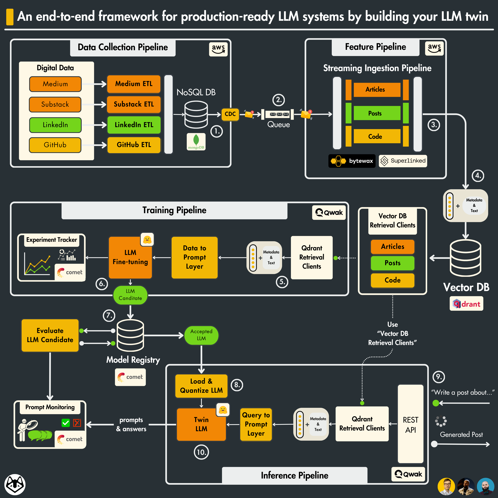
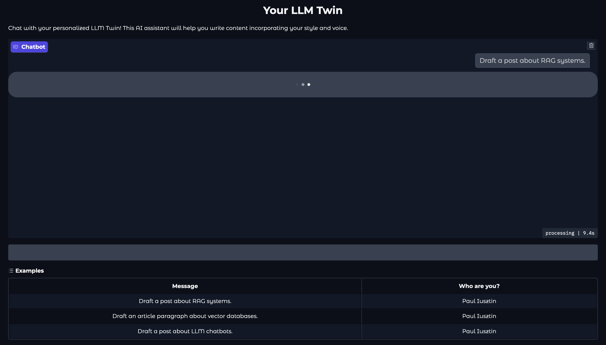
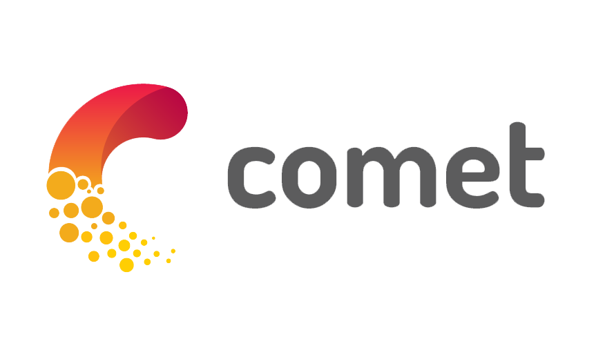
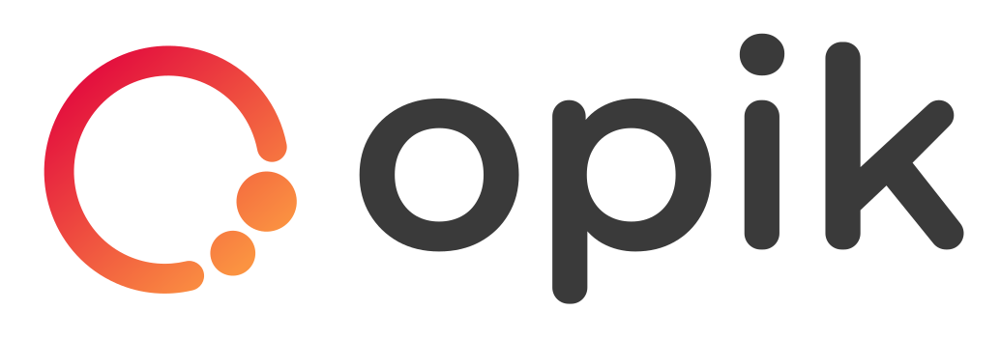
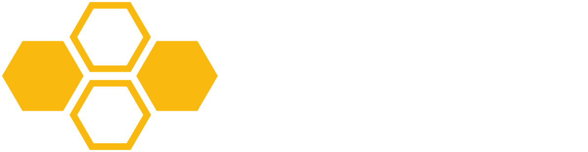
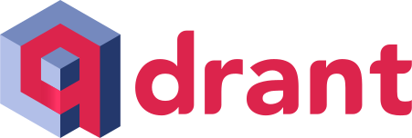
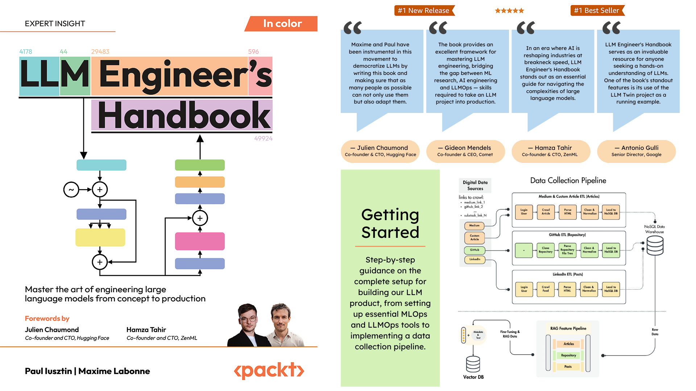

<div align="center">
    <h2>LLM Twin Course: Building Your Production-Ready AI Replica</h2>
    <h1>Learn to architect and implement a production-ready LLM & RAG system by building your LLM Twin</h1>
    <h3>From data gathering to productionizing LLMs using LLMOps good practices.</h3>
    <i>by <a href="https://decodingml.substack.com">Decoding ML</i>
</div>

</br>

<p align="center">
  
</p>

## What you'll learn

*By finishing the **"LLM Twin: Building Your Production-Ready AI Replica"** free course, you will learn how to design, train, and deploy a production-ready LLM twin of yourself powered by LLMs, vector DBs, and LLMOps good practices.*

**No more isolated scripts or Notebooks!** Learn production ML by building and deploying an end-to-end production-grade LLM system.

## About this course

You will **learn** how to **architect** and **build a real-world LLM system** from **start** to **finish** - from **data collection** to **deployment**.

You will also **learn** to **leverage MLOps best practices**, such as experiment trackers, model registries, prompt monitoring, and versioning.

**The end goal?** Build and deploy your own LLM twin.

**What is an LLM Twin?** It is an AI character that learns to write like somebody by incorporating its style and personality into an LLM.

## The architecture of the LLM Twin is split into 4 Python microservices:

<p align="center">
  
</p>

### The data collection pipeline

- Crawl your digital data from various social media platforms, such as Medium, Substack and GitHub.
- Clean, normalize and load the data to a [Mongo NoSQL DB](https://www.mongodb.com/) through a series of ETL pipelines.
- Send database changes to a [RabbitMQ](https://www.rabbitmq.com/) queue using the CDC pattern.
- Learn to package the crawlers as AWS Lambda functions.

### The feature pipeline

- Consume messages in real-time from a queue through a [Bytewax](https://github.com/bytewax/bytewax?utm_source=github&utm_medium=decodingml&utm_campaign=2024_q1) streaming pipeline.
- Every message will be cleaned, chunked, embedded and loaded into a [Qdrant](https://qdrant.tech/?utm_source=decodingml&utm_medium=referral&utm_campaign=llm-course) vector DB.
- In the bonus series, we refactor the cleaning, chunking, and embedding logic using [Superlinked](https://github.com/superlinked/superlinked?utm_source=community&utm_medium=github&utm_campaign=oscourse), a specialized vector compute engine. We will also load and index the vectors to a [Redis vector DB](https://redis.io/solutions/vector-search/).

### The training pipeline

- Create a custom instruction dataset based on your custom digital data to do SFT.
- Fine-tune an LLM using LoRA or QLoRA.
- Use [Comet ML's](https://www.comet.com/signup/?utm_source=decoding_ml&utm_medium=partner&utm_content=github) experiment tracker to monitor the experiments.
- Evaluate the LLM using [Opik](https://github.com/comet-ml/opik)
- Save and version the best model to the [Hugging Face model registry](https://huggingface.co/models).
- Run and automate the training pipeline using [AWS SageMaker](https://aws.amazon.com/sagemaker/).

### The inference pipeline

- Load the fine-tuned LLM from the [Hugging Face model registry](https://huggingface.co/models).
- Deploy the LLM as a scalable REST API using [AWS SageMaker inference endpoints](https://aws.amazon.com/sagemaker/deploy/).
- Enhance the prompts using advanced RAG techniques.
- Monitor the prompts and LLM generated results using [Opik](https://github.com/comet-ml/opik)
- In the bonus series, we refactor the advanced RAG layer to write more optimal queries using [Superlinked](https://github.com/superlinked/superlinked?utm_source=community&utm_medium=github&utm_campaign=oscourse).
- Wrap up everything with a Gradio UI (as seen below) where you can start playing around with the LLM Twin to generate content that follows your writing style.

<p align="center">
  
</p>

Along the 4 microservices, you will learn to integrate 4 serverless tools:

* [Comet ML](https://www.comet.com/signup/?utm_source=decoding_ml&utm_medium=partner&utm_content=github) as your experiment tracker and data registry;
* [Qdrant](https://qdrant.tech/?utm_source=decodingml&utm_medium=referral&utm_campaign=llm-course) as your vector DB;
* [AWS SageMaker](https://aws.amazon.com/sagemaker/) as your ML infrastructure;
* [Opik](https://github.com/comet-ml/opik) as your prompt evaluation and monitoring tool.

## Who should join?

**This course is ideal for:**
- ML/AI engineers who want to learn to engineer production-ready LLM & RAG systems using LLMOps good principles
- Data Engineers, Data Scientists, and Software Engineers wanting to understand the engineering behind LLM & RAG systems

**Note:** This course focuses on engineering practices and end-to-end system implementation rather than theoretical model optimization or research.

## Prerequisites

| Category | Requirements |
|----------|-------------|
| **Skills** | Basic understanding of Python and Machine Learning |
| **Hardware** | Any modern laptop/workstation will do the job, as the LLM fine-tuning and inference will be done on AWS SageMaker. |
| **Level** | Intermediate |

## Cost structure

All tools used throughout the course will stick to their free tier, except:

- OpenAI's API, which will cost ~$1
- AWS for fine-tuning and inference, which will cost < $10 depending on how much you play around with our scripts and your region.

## Open-source course: Participation is open and Free

As an open-source course, you don't have to enroll. Everything is self-paced, free of charge and with its resources freely accessible as follows:
- **code**: this GitHub repository
- **articles**: [Decoding ML](https://medium.com/decodingml/llm-twin-course/home)

## How will you learn?

The course contains **10 hands-on written lessons** and the **open-source code** you can access on GitHub, showing how to build an end-to-end LLM system.

Also, it includes **2 bonus lessons** on how to **improve the RAG system**.

You can read everything at your own pace.

## Lessons

This self-paced course consists of 12 comprehensive lessons covering theory, system design, and hands-on implementation.

Our recommendation for each lesson:
1. Read the article
2. Run the code
3. Read the source code in depth

| Lesson | Article | Category | Description | Source Code |
|--------|---------|----------|-------------|-------------|
| 1 | [An End-to-End Framework for Production-Ready LLM Systems](https://medium.com/decodingml/an-end-to-end-framework-for-production-ready-llm-systems-by-building-your-llm-twin-2cc6bb01141f) | System Design | Learn the overall architecture and design principles of production LLM systems. | No code |
| 2 | [Data Crawling](https://medium.com/decodingml/your-content-is-gold-i-turned-3-years-of-blog-posts-into-an-llm-training-d19c265bdd6e) | Data Engineering | Learn to crawl and process social media content for LLM training. | `src/data_crawling` |
| 3 | [CDC Magic](https://medium.com/decodingml/i-replaced-1000-lines-of-polling-code-with-50-lines-of-cdc-magic-4d31abd3bc3b) | Data Engineering | Learn to implement Change Data Capture (CDC) for syncing two data sources. | `src/data_cdc` |
| 4 | [Feature Streaming Pipelines](https://medium.com/decodingml/sota-python-streaming-pipelines-for-fine-tuning-llms-and-rag-in-real-time-82eb07795b87) | Feature Pipeline | Build real-time streaming pipelines for LLM and RAG data processing. | `src/feature_pipeline` |
| 5 | [Advanced RAG Algorithms](https://medium.com/decodingml/the-4-advanced-rag-algorithms-you-must-know-to-implement-5d0c7f1199d2) | Feature Pipeline | Implement advanced RAG techniques for better retrieval. | `src/feature_pipeline` |
| 6 | [Generate Fine-Tuning Instruct Datasets](https://medium.com/decodingml/turning-raw-data-into-fine-tuning-datasets-dc83657d1280) | Training Pipeline | Create custom instruct datasets for LLM fine-tuning. | `src/feature_pipeline/generate_dataset` |
| 7 | [LLM Fine-tuning Pipeline](https://medium.com/decodingml/8b-parameters-1-gpu-no-problems-the-ultimate-llm-fine-tuning-pipeline-f68ef6c359c2) | Training Pipeline | Build an end-to-end LLM fine-tuning pipeline and deploy it to AWS SageMaker. | `src/training_pipeline` |
| 8 | [LLM & RAG Evaluation](https://medium.com/decodingml/the-engineers-framework-for-llm-rag-evaluation-59897381c326) | Training Pipeline | Learn to evaluate LLM and RAG system performance. | `src/inference_pipeline/evaluation` |
| 9 | [Implement and Deploy the RAG Inference Pipeline](https://medium.com/decodingml/beyond-proof-of-concept-building-rag-systems-that-scale-e537d0eb063a) | Inference Pipeline | Design,  implement and deploy the RAG inference to AWS SageMaker. | `src/inference_pipeline` |
| 10 | [Prompt Monitoring](https://medium.com/decodingml/the-ultimate-prompt-monitoring-pipeline-886cbb75ae25) | Inference Pipeline | Build the prompt monitoring and production evaluation pipeline. | `src/inference_pipeline` |
| 11 | [Refactor the RAG module using 74.3% Less Code ](https://medium.com/decodingml/build-a-scalable-rag-ingestion-pipeline-using-74-3-less-code-ac50095100d6) | Bonus on RAG | Optimize the RAG system. | `src/bonus_superlinked_rag` |
| 12 | [Multi-Index RAG Apps](https://medium.com/decodingml/build-multi-index-advanced-rag-apps-bd33d2f0ec5c) | Bonus on RAG | Build advanced multi-index RAG apps. | `src/bonus_superlinked_rag` |

> [!NOTE]
> Check the [INSTALL_AND_USAGE](https://github.com/decodingml/llm-twin-course/blob/main/INSTALL_AND_USAGE.md) doc for a step-by-step installation and usage guide.

## Project Structure

At Decoding ML we teach how to build production ML systems, thus the course follows the structure of a real-world Python project:

```text
llm-twin-course/
├── src/                     # Source code for all the ML pipelines and services
│ ├── data_crawling/         # Data collection pipeline code
│ ├── data_cdc/              # Change Data Capture (CDC) pipeline code
│ ├── feature_pipeline/      # Feature engineering pipeline code
│ ├── training_pipeline/     # Training pipeline code
│ ├── inference_pipeline/    # Inference service code
│ └── bonus_superlinked_rag/ # Bonus RAG optimization code
├── .env.example             # Example environment variables template
├── Makefile                 # Commands to build and run the project
├── pyproject.toml           # Project dependencies
```

## Install & Usage

To understand how to **install and run the LLM Twin code end-to-end**, go to the [INSTALL_AND_USAGE](https://github.com/decodingml/llm-twin-course/blob/main/INSTALL_AND_USAGE.md) dedicated document.

> [!NOTE]
> Even though you can run everything solely using the [INSTALL_AND_USAGE](https://github.com/decodingml/llm-twin-course/blob/main/INSTALL_AND_USAGE.md) dedicated document, we recommend that you read the articles to understand the LLM Twin system and design choices fully.


## Questions and troubleshooting

Have questions or running into issues? We're here to help!

Open a [GitHub issue](https://github.com/decodingml/llm-twin-course/issues) for:
- Questions about the course material
- Technical troubleshooting
- Clarification on concepts


## Contributing

As an open-source course, we may not be able to fix all the bugs that arise.

If you find any bugs and know how to fix them, support future readers by contributing to this course with your bug fix.

We will deeply appreciate your support for the AI community and future readers 🤗


## Contributors

A big "Thank you 🙏" to all our contributors! This course is possible only because of their efforts.

<p align="center">
    <a href="https://github.com/decodingml/llm-twin-course/graphs/contributors">
      
    </a>
</p>

## Sponsors

Also, another big "Thank you 🙏" to all our sponsors who supported our work and made this course possible. 

<table>
  <tr>
    <td align="center">
      <a href="https://www.comet.com/signup/?utm_source=decoding_ml&utm_medium=partner&utm_content=github" target="_blank">Comet</a>
    </td>
    <td align="center">
      <a href="https://github.com/comet-ml/opik" target="_blank">Opik</a>
    </td>
    <td align="center">
      <a href="https://github.com/bytewax/bytewax?utm_source=github&utm_medium=decodingml&utm_campaign=2024_q1" target="_blank">Bytewax</a>
    </td>
    <td align="center">
      <a href="https://qdrant.tech/?utm_source=decodingml&utm_medium=referral&utm_campaign=llm-course" target="_blank">Qdrant</a>
    </td>
    <td align="center">
      <a href="https://github.com/superlinked/superlinked?utm_source=community&utm_medium=github&utm_campaign=oscourse" target="_blank">Superlinked</a>
    </td>
  </tr>
  <tr>
    <td align="center">
      <a href="https://www.comet.com/signup/?utm_source=decoding_ml&utm_medium=partner&utm_content=github" target="_blank">
        
      </a>
    </td>
    <td align="center">
      <a href="https://github.com/comet-ml/opik" target="_blank">
        
      </a>
    </td>
    <td align="center">
      <a href="https://github.com/bytewax/bytewax?utm_source=github&utm_medium=decodingml&utm_campaign=2024_q1" target="_blank">
        
      </a>
    </td>
    <td align="center">
      <a href="https://qdrant.tech/?utm_source=decodingml&utm_medium=referral&utm_campaign=llm-course" target="_blank">
        
      </a>
    </td>
    <td align="center">
      <a href="https://github.com/superlinked/superlinked?utm_source=community&utm_medium=github&utm_campaign=oscourse" target="_blank">
        
      </a>
    </td>
  </tr>
</table>

## Next steps

Our **LLM Engineer’s Handbook** inspired the **open-source LLM Twin course**.

Consider supporting our work by getting our book to **learn** a **complete framework** for **building and deploying production LLM & RAG systems** — from data to deployment.

Perfect for practitioners who want **both theory** and **hands-on** expertise by connecting the dots between DE, research, MLE and MLOps:

**[Buy the LLM Engineer’s Handbook](https://www.amazon.com/LLM-Engineers-Handbook-engineering-production/dp/1836200072/)**

* [On Amazon](https://www.amazon.com/LLM-Engineers-Handbook-engineering-production/dp/1836200072/)
* [On Packt](https://www.packtpub.com/en-us/product/llm-engineers-handbook-9781836200062)

<p align="center">
  <a href="https://www.amazon.com/LLM-Engineers-Handbook-engineering-production/dp/1836200072/">
    
  </a>
</p>

## License

This course is an open-source project released under the MIT license. Thus, as long you distribute our LICENSE and acknowledge our work, you can safely clone or fork this project and use it as a source of inspiration for whatever you want (e.g., university projects, college degree projects, personal projects, etc.).